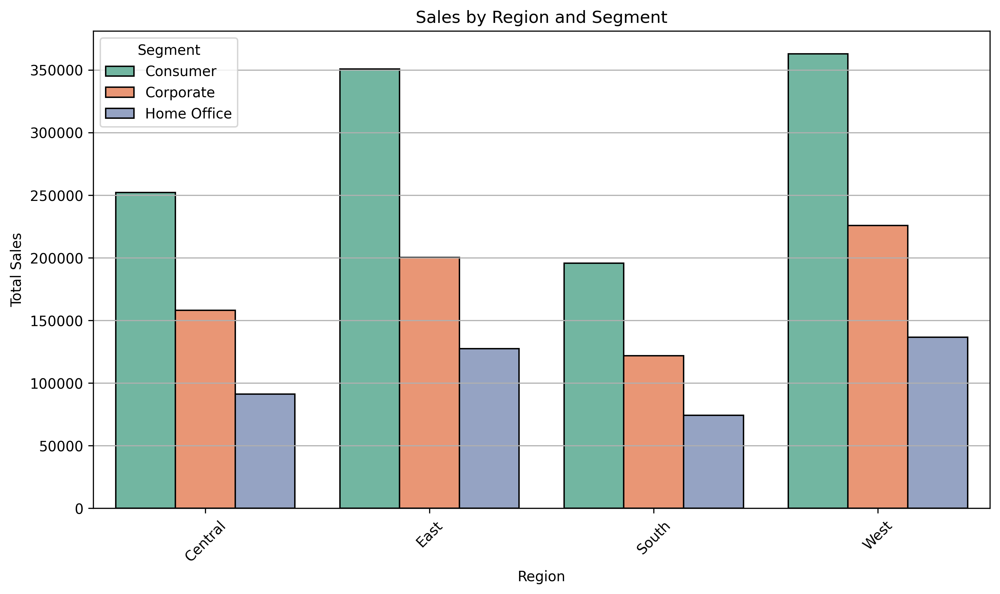
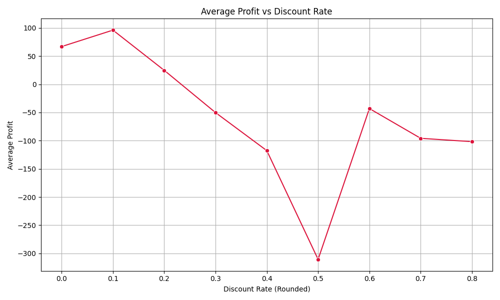
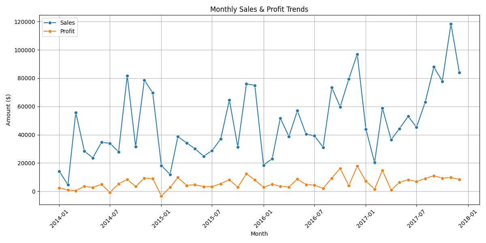

# 🛍️ Retail Sales Analysis (Superstore Dataset)

This project explores and analyzes retail sales data from a fictional superstore using Python and AI-assisted tools (ChatGPT). The goal is to identify key sales trends, profitability drivers, and actionable business insights.

---

## 📁 Project Structure

```
Retail-Sales-Analysis/
│
├── data/               # Raw dataset
├── notebooks/          # Jupyter notebooks for cleaning & analysis
├── visuals/            # Charts & visuals
├── README.md           # Project overview
└── findings-presentation.pptx 
```

---

## 📌 Objectives

- 🧼 Clean and prepare raw sales data  
- 📊 Explore trends in sales, profit, and discounting  
- 📈 Analyze performance by region, segment, and category  
- 🧠 Use AI prompts (ChatGPT) to assist in analysis, code generation, and insight writing

---

## 🧪 Dataset

- **Name:** Superstore Sales Data  
- **Source:** [Kaggle Dataset](https://www.kaggle.com/datasets/vivek468/superstore-dataset-final)  
- **Features:** Orders, Sales, Profit, Discounts, Shipping, Customer Info

---

## 🛠️ Tools Used

- **Python**: Pandas, Matplotlib, Seaborn  
- **Jupyter Notebook**  
- **ChatGPT** (for assisted data cleaning, code writing, and insight generation)

---

## 🔍 Project Workflow

1. **Data Cleaning**: Handle dates, nulls, and column consistency  
2. **Exploratory Analysis**: Understand sales & profit patterns  
3. **Visualization**: Create charts for clear insight communication  
4. **AI Support**: Use generative AI to explain, debug, and enhance analysis  
5. **Business Insights**: Generate findings and improvement suggestions

---

## 📈 Sample Questions Answered

- What regions generate the most profit?
- Which categories are consistently underperforming?
- How does discounting impact profit margins?

---

## ✅ Results

### 📊 Sales by Region and Segment


- West and East regions lead in total sales.
- Consumer segment dominates across all regions.
- Home Office segment is the weakest performer.

### 📉 Profit vs Discount Rate


- Higher discount rates are clearly linked to lower average profit.
- Profitability drops significantly after a 30% discount.
- Company should review aggressive discount strategies.

### 📆 Monthly Sales & Profit Trends


- Sales and profit vary significantly month to month, suggesting seasonality or promo cycles.  
- Some high-sales months yield low profit, indicating potential over-discounting.  
- This trend analysis helps in forecasting and planning better promotions.

---

## 📌 License

This project is for educational and portfolio purposes. Data sourced from Kaggle (public dataset).
